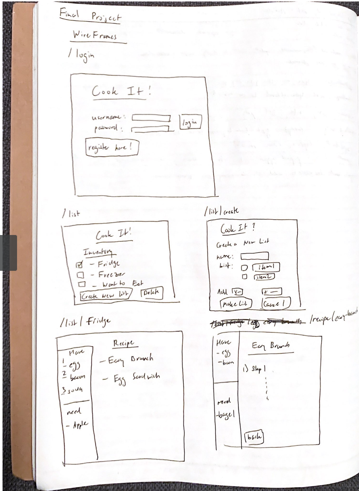
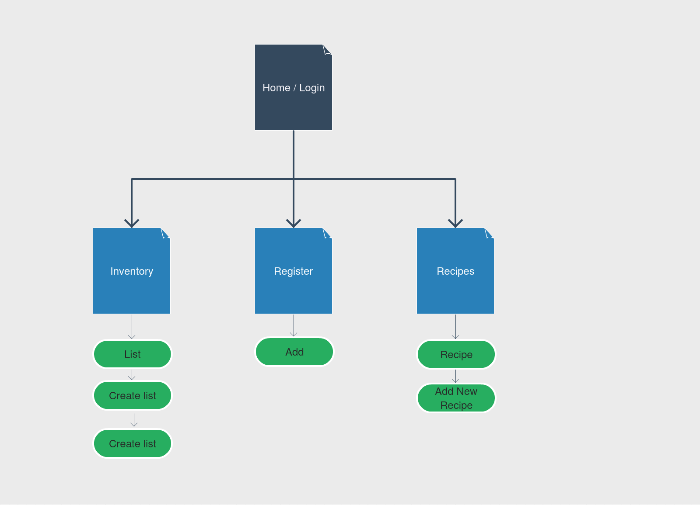

# CookIt

## Overview

Sometimes, it's hard to figure out what you can cook up with the ingredients found in your fridge. Other times, you want to know
where and what ingredients you are missing for that delicious dinner. 

CookIt is a web app that allows users to keep track of their ingredients and matches them to a database of recipes. Users can register and login, and once logged in they can update their inventory and add to it using a grocery list. 


## Data Model

The application will store Users, Lists, Ingredients, and Recipes

* each recipe will have ingredients tied to it (reference)
* each ingredient will also have recipes tied to it (reference)
* each user can have multiple ingredients lists/ recipes (embedded)


An Example User with Embedded Ingredients and Recipes:

```javascript
{
  username: "testcook",
  hash: // a password hash,
  list: // list of ingredients
  recipe: // list of personal recipes 
}
```

An Example Recipe:

```javascript
{
  user: // a reference to a User object
  name: "English Breakfast",
  ingredients: [
    { name: "egg", quantity: "two", owns: true},
    { name: "butter", quantity: "one tablespoon", owns: false},
    { name: "bacon", quantitty: "three slices", owns: true}
  ],
  steps: "1. Heat the Pan and add a dash of oil once hot. .... etc"
}

```

An Example Ingredient List:

```javascript
{
  user: // a reference to a User object
  name: "My Fridge",
  items: [
    { name: "soda", quantity: "one liter", owns: true, recipes: /*reference to list of recipes w/ this item */ },
    { name: "egg", quantity: "one dozen", owns: true, recipes: /*reference to recipes w/ this item */},
    { name: "bacon", quantitty: "twelve slices", owns: true, recipes: /*reference to recipes w/ this item */ }
  ],
}
```

## [Link to Commented First Draft Schema](db.js) 

## Wireframes



## Site map



## User Stories or Use Cases

1. as a non-registered user, I can register an account on the site
2. as a user, I can log in/log out to the site
3. as a user, I can a new inventory list of ingredients
4. as a user, I can view all possible recipes with said ingredients from most to least
5. as a user, I can add ingredients to my inventory
6. as a user, I can remove ingredients
7. as a user, I can add new recipes to the site
8. as an admin, I can add/remove existing recipes

## Research Topics

* (6 points) Integrate user authentication
    * I've never done user authentication with javascript before.
    * If it's anything like django's framework, I have assigned it 4 points with some basis of familiarity
* (1-2 points) BootStrap CSS
    * as bootstrap and other css modules are relatively easy to operate from what I've heard, I've assigned it 2 points
* (1-2 points) Form Validation
    * I'm planning on adding form validation for the registration 
10 points total out of 8 required points (___TODO__: addtional points will __not__ count for extra credit_)


## [Link to Initial Main Project File](app.js) 


## Annotations / References Used

1. [passport.js authentication docs](http://passportjs.org/docs) 
2. [Selenium docs](https://www.selenium.dev/documentation/en/)
3. [Sample Recipes](https://github.com/raywenderlich/recipes/blob/master/Recipes.json)
4. [Sample passport js code](https://mherman.org/blog/local-authentication-with-passport-and-express-4/)
5. [Sample passport js code](https://medium.com/@kevinhsu_83500/user-authentication-with-node-js-and-mongodb-c8b1645513f9)
